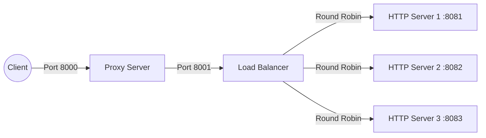

# Raw Network Stack

A fully functional, low-level network stack built entirely in raw Python from scratch. This project demonstrates how modern web infrastructure (HTTP servers, Reverse Proxies, and Load Balancers) operates under the hood by manipulating raw TCP sockets and byte streams.

**Zero external dependencies for the core logic.**

## Architecture

This project is built in layers, with each component extending the capabilities of the previous one:

1. **`TCPServer`**: The foundation. Handles raw socket binding, listening, and accepting client connections.
2. **`HTTPServer`**: Parses raw bytes into HTTP requests (`HTTPRequest`) and serializes HTTP responses (`HTTPResponse`). Features a basic routing engine.
3. **`ProxyServer`**: A Reverse Proxy that sits in front of the HTTP Server. Uses `select.select()` for non-blocking I/O multiplexing to stream data between the client and the backend server.
4. **`LoadBalancerServer`**: Inherits from the Proxy and implements a thread-safe **Round Robin** algorithm to distribute incoming traffic across a pool of backend HTTP servers.

### The Pipeline



## Features

- **Raw TCP Sockets**: Built using Python's built-in `socket` library.
- **Multiplexing**: Uses `select` for efficient, non-blocking I/O proxying.
- **Thread-Safety**: Uses `threading.Lock()` to secure the Round Robin algorithm against race conditions.
- **Clean Architecture**: Follows DRY principles, OOP inheritance, and the `src-layout` pattern.
- **Dockerized**: Fully orchestrated with Docker Compose for a one-click deployment of the entire 5-container topology.

## Running with Docker (Recommended)

The easiest way to spin up the entire distributed architecture is via Docker Compose.

```bash
docker compose up --build
```

This will start:

- 3 separate HTTP backend servers (hidden in the Docker network)
- 1 Load Balancer routing to the backends
- 1 Proxy Server exposing port `8000` to your host machine

To test the load balancer, run this in a new terminal or your browser:

```bash
curl http://localhost:8000/api/status
```

_(Run it multiple times to see the Load Balancer cycle through different backend server ports!)_

## Running Locally (Manual Setup)

If you want to run the scripts individually on your host machine to observe the logs in separate terminals, use the `PYTHONPATH` variable:

1. **Start HTTP Servers**:
   ```bash
   PYTHONPATH=src uv run python src/app/run_http_server.py 8081
   PYTHONPATH=src uv run python src/app/run_http_server.py 8082
   PYTHONPATH=src uv run python src/app/run_http_server.py 8083
   ```
2. **Start Load Balancer**:
   ```bash
   PYTHONPATH=src uv run python src/app/run_load_balancer.py
   ```
3. **Start Proxy Server**:
   ```bash
   PYTHONPATH=src uv run python src/app/run_proxy_server.py
   ```

## Available API Endpoints

The HTTP Server comes with the following mock endpoints:

- `GET /api/status` - Health check (returns the port of the backend that handled the request).
- `GET /api/users` - Returns a JSON list of mock users.
- `POST /api/echo` - Echoes back exactly whatever body payload you send it.

## Running Tests

The project includes a robust suite of unit tests written with `pytest`, including complex concurrency tests for thread safety and connection refusal handling.

```bash
uv run pytest
```

---

_Built as a deep-dive educational project into network engineering and socket programming._
